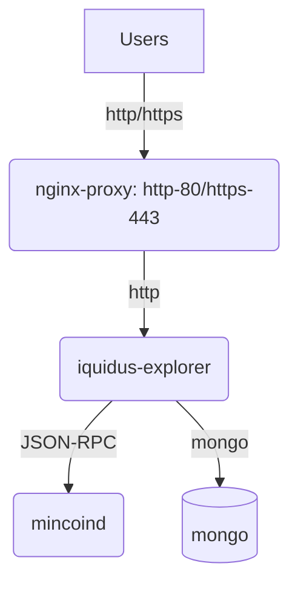

# mincoin-block-explorer

This repo is for setting up `mincoind` with `iquidus-explorer` in docker containers.

## TL;DR:
```
$ git submodule update --init  # this will pull the git repo https://github.com/iquidus/explorer and save to .iquidus-explorer/ folder

$ make up  # this will call docker-compose to spin up the containers
Please enter your Virtual Host: www.scryptcoin.com

# the Virtual Host name entered here will be used for:
# 1. replacing the `"addresses"` in `settings.json` for `iquidus-explorer` container
# 2. setting environment variable VIRTUAL_HOST for `iquidus-explorer` container, to be picked-up by `nginx-proxy` container to dynamically generate virtual host config.
```
This will create these containers for you:
```
CONTAINER ID   IMAGE                               COMMAND                  CREATED          STATUS                  PORTS                                       NAMES
54e91875c89f   iquidus-explorer-iquidus-explorer   "docker-entrypoint.s…"   3 minutes ago    Up 3 minutes            3001/tcp                                    iquidus-explorer
adc231ec417f   mincoin/mincoin-0-14.3:latest       "./bin/mincoind -ser…"   10 minutes ago   Up 10 minutes           9334-9335/tcp                               mincoind
7012ce3d44ad   jwilder/nginx-proxy:alpine          "/app/docker-entrypo…"   42 minutes ago   Up 42 minutes           0.0.0.0:80->80/tcp, :::80->80/tcp           nginx-proxy
7464bab9d21a   mongo:3.2.16                        "docker-entrypoint.s…"   47 minutes ago   Up 47 minutes           27017/tcp                                   mongo
```

## System Architecture


## Notes:
1. [nginx-proxy](https://hub.docker.com/r/jwilder/nginx-proxy) is used to dynamically generate nginx config.
2. This repo only setup port 80 (HTTP), for sake of security, you would need another layer to take care of the HTTPS cert. If you want to do this with `nginx-proxy`, please follow its documentation.
3. Since `iquidus-explorer` is calling `mincoind` with JSON-RPC, `mincoind` was started as a server with specific allowed RPC client IP address. The allowed IP addresses were calculated by the CIDR of the docker network used in this project: `local_backend`. This can be seen in the Makefile for target `docker-network-cidr` and the `command` in the mincoind's `docker-compose.yml` file.
4. mongo version 3 was used in this project, as there would be some bugs in higher version for server that doesn't have AVX support for their CPU.
5. Although all containers in this project were encapsulated in the docker network `local_backend`, there is a need to port-forward TCP 80 to the docker host. Please make sure there won't be any port conflict with other containers on the same host, even they might be in different docker networks.
